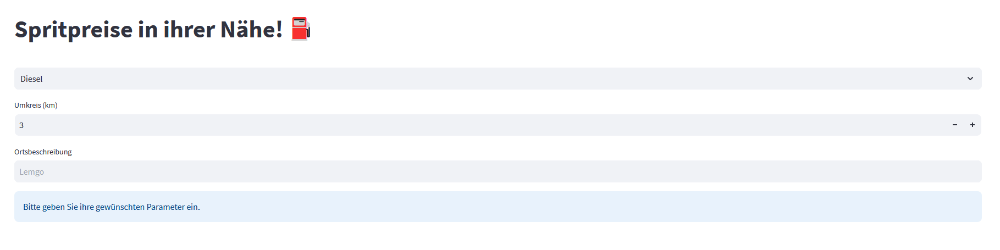

# Benzinpreise mit Streamlit visualisieren

Mit diesem Studentenprojekt können auf einfache Weise Preisinformationen verschiedener Spritsorten von verschiedenen Tankstellen in einem bestimmten geografischen Radius abgefragt werden. Die Preisinformationen werden von der API "Tankerkönig" bezogen.

Lauffähige App auf Streamlit.io: [https://benzinpreise-jtqng8xt14a.streamlit.app/](https://benzinpreise-jtqng8xt14a.streamlit.app/)



# Entwicklungsinformationen

Um das Projekt auf ihrer Maschine zu erstellen (nachdem Sie es geklont haben), benötigen Sie die Python Packages aus der "requirements.txt" Datei:

```pip install -r requirements.txt```

Falls "Streamlit" noch nicht installiert ist: 

```pip install streamlit```

Danach kann das Projekt mit der Streamlit CLI gestartet werden:

```streamlit run app.py```


